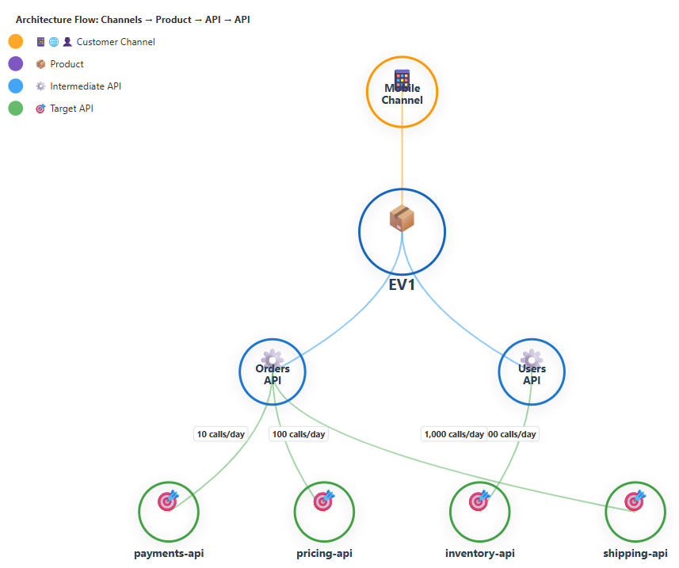
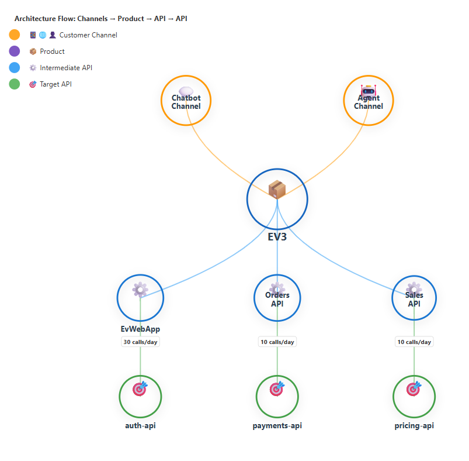
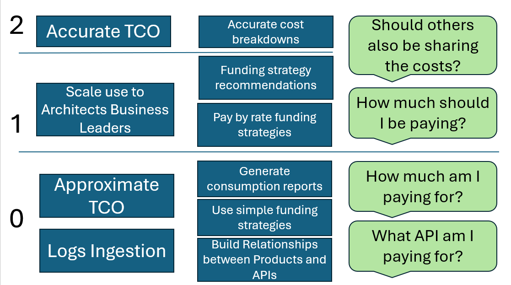

# Under Product

<p align="center">
  
</p>

## Purpose

Under Product is a capability that solves the transparency issue that exists between Product and APIs, and makes it clear to Product teams why and how they are connected to APIs, stacks and tools that the business depends on. 

The outcome is for API longevity to be extended, and constant re-writes/waste of investments to be reduced.

## Relevance in AI era

As more business teams will start prototyping/building apps without IT, there will still be a reliance on integration between common services within an organisation or outside.
Keeping track of how all these apps and services are interacting with the end product is essential.

## Relationship views

For business teams funding technology initiatives, it can be hard to comprehend the costs and the rationale for changing an API 2 times removed from the actual product. These frustrations leads to tensions between teams and short term decisions that sounds right, but cause further technical debt and pain down the line.

If an Architect, or the Tech savvy Business Product Owner, had the ability to pull up a view explaining how his Product maps to capabilities/APIs that are essential for the health and success of the Product, then there is a chance for better understanding.

<p align="center">
  
</p>


The problem remains the same as more AI capabilities (and dependencies) are added to the estate, there will always be need to connect the dots. 

<p align="center">
  
</p>

### How does the current app exist

1. Standalone App
2. As a plugin to an API Portal (Not yet built)
3. As a plugin to a Gateway (Not yet built)

# Domain

Using DDD to spell out the Ubiquitous Language,

> A Product is something of value exchanged from a business to customers

> A Channel is used to distribute a Product to Customers. The channel relies on APIs for various functionalities to be processed for the Customer. Some of the APIs also rely on other APIs to enable certain functionalities to be fulfilled.

> At design time, the Pricing Strategy of an API will be chosen, and it will have the rules to calculate how the Total Cost of Ownership.

> The first type of Pricing Strategy is called Most Profitable Pays (MPP), which essentially means the Product making the most profit pays for the API.

> The 2nd type of Pricing Strategy is called Equal Share(ES), which means that it is shared by the number of Products needing it equally.

> The 3rd type of Pricing Strategy is called Pay by Rate (PbR), which means that the cost of the API is shared across Products based on the number of calls made to an API by particular Products.

# How it works

## API Headers for traceability

From an Architecture standpoint, communicating that all Applications and underlying layers will use headers to capture the product and the previous layer that called an API, will support the building of a near real-time model that would drive the analytics and reporting that prevent organisational friction during budgeting hour.

This can be rolled out through a script to GitHub repos where applications and APIs are hosted. For this current version of Under Product, it will be a manual change.

```json
{
    "OriginatingProduct": "Employee Retention",
    "Channel": "Web",
    "CallingLayer": "Salary API",
    "CalledLayer": "Payments API"
}
```


## Data Sources

Under-Product reads the API header logs and uses the Api Metadata, which could be stored in an API Catalogue or an architecture repository, to contruct a summary of 
- API usage by Product
- API cost allocation per API

# Maturity model

You don't need every data point to get started, and here is the high level guidance



Starting just by collecting the minimum amount of data through the logs, with the api headers, and gradually make the TCO data more accurate to be able to answer the questions that often disrupt API strategies.


